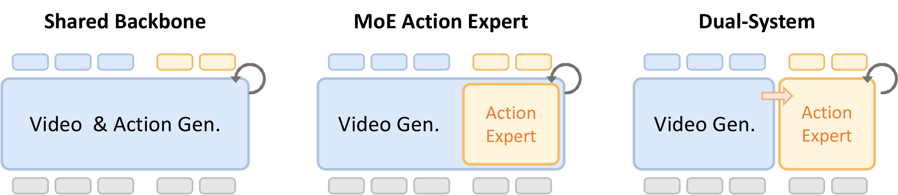

# OpenWAM

<!--
## What is OpenWAM

OpenWAM is an open-source framework for **World-Action Models (WAMs)**: video-diffusion policies that jointly model future visual dynamics and robot actions.

The repository is organized around the `openwam/` package and currently supports:

- Hydra-based training and deployment entrypoints
- WAM-specific action/video scheduling and receding-horizon execution
- RoboTwin dataset adapter with multi-task, multi-view support
- Two WAM architecture families: dual-system and shared backbone variants
- A policy server for robot deployment workflows



## What OpenWAM Focuses On

OpenWAM is not a VLA clone. Its core direction is to use a video world model as the control backbone.

- Backbone: Wan-family video diffusion models
- Action modeling: flow-matched action generation coupled to video denoising
- Strengths: temporal coherence, world-model-style rollout, flexible denoising schedules
- Primary use cases: joint video-action generation, action-only rollout, robot deployment
-->

## Repository Layout

```text
OpenWAM/
├── openwam/
│   ├── dataloader/    # Dataset adapters (RoboTwin), transforms, processors, registry
│   ├── model/
│   │   ├── architectures/    # WAM families: dual_system, shared_backbone, tri_system
│   │   ├── action_backbone/  # ActionBackbone ABCs, separate ActionDiT, shared action backbone,
│   │   │                     #   latent action encoder/decoder, scheduler
│   │   ├── video_backbone/   # VideoBackbone ABC, Wan backbones, encoder/ (VAE / DINOv3 / V-JEPA 2.1)
│   │   └── vlm_backbone/     # VlmBackbone ABC, Qwen3-VL backbone
│   ├── train/         # OpenWAMTrainer, flow-match loss, checkpointing, optimizer utils
│   └── deploy/        # Policy server, model loader, inference engine, executors, optimizations
├── scripts/           # Entrypoints: train.sh, deploy.sh, inference tests, SVAE / LAPA tooling
├── configs/           # Hydra configs for model, dataloader, accelerate, deploy
├── tests/             # Unit tests
├── benchmarks/
│   ├── robotwin/      # RoboTwin eval client, single / multi / DLC-parallel eval scripts
│   ├── libero/        # LIBERO / LIBERO-plus WebSocket eval client
│   ├── robocasa_gr1/  # RoboCasa GR1 tabletop eval client
│   └── vlabench/      # VLABench eval client, single / multi-GPU track sweeps
├── assets_repo/       # Architecture diagrams
└── third_party/       # Vendored externals (Cosmos-Predict2.5 submodule)
```

## Support Status

### Architectures

| Architecture | Variant | Description |
|---|---|---|
| `shared_backbone` | `vanilla` | Single shared DiT carries video + action + state tokens in one sequence |
| `shared_backbone` | `moe` | Shared DiT with mixture-of-experts FFN layers (expert FFN on the bridge layers) |
| `dual_system` | `joint_self_attn` | Separate ActionDiT + video DiT, fused per layer via one mixed self-attention (MoT driver). |
| `dual_system` | `joint_cross_attn` | Video DiT runs to completion → bridge features → ActionDiT runs once with cross-attention to them. Sub-variants via `detach_bridge`: `false` lets action gradients flow back into the video DiT, `true` blocks them (ActionDiT trains on detached video features) |
| `dual_system` | `idm` | Inverse-dynamics-style teacher-forcing training + two-stage inference; Wan, Cosmos-Predict2.5 and Cosmos3-Edge |
| `tri_system` | `joint_self_attn` | Adds a frozen VLM understanding expert to the joint self-attention sequence (`[video + action + understanding]`) |

All architectures are selected via `configs/model/<framework>.yaml` with `architecture.variant`. The video backbone is composed from the Hydra `video_backbone` group (default `wan22_ti2v_5b`).

### Benchmarks and Evaluation

| Benchmark | Status | Notes |
|---|---|---|
| RoboTwin eval | Supported | All 50 tasks; see `benchmarks/robotwin/` |
| SimplerEnv eval | Planned | Requires external environment setup |
| LIBERO eval | Supported | LIBERO and LIBERO-plus; see `benchmarks/libero/` |
| RoboCasa GR1 eval | Supported | GR1 tabletop tasks; see `benchmarks/robocasa_gr1/` |
| VLABench eval | Supported | 10 primitive tasks across 6 evaluation tracks; see `benchmarks/vlabench/` |
| Calvin eval | Planned | Requires external environment setup |
| BEHAVIOR-1K eval | Planned | Requires external environment setup |

## Installation

### Base installation

```bash
conda create -n openwam python=3.12

conda activate openwam
```

We recommend using PyTorch 2.7.1 with CUDA 12.8 （others may also work）:

```bash
pip install torch==2.7.1 torchvision==0.22.1 torchaudio==2.7.1 --index-url https://download.pytorch.org/whl/cu128
```

Then install OpenWAM:

```bash
pip install -e .
```

## Quick Start

### 0. Data Preparation

**Download the video backbone (Wan2.2-TI2V-5B):**

```bash
huggingface-cli download Wan-AI/Wan2.2-TI2V-5B \
  --local-dir /path/to/Wan2.2-TI2V-5B
```

**Download the RoboTwin dataset:**

Full dataset or individual task zips can be downloaded from the HuggingFace Hub. For example, to download a single task:

```bash
huggingface-cli download TianxingChen/RoboTwin2.0 \
  dataset/adjust_bottle/aloha-agilex_clean_50.zip \
  --repo-type dataset \
  --local-dir /path/to/robotwin_2_0
```

After downloading, unzip the task files:

```bash
cd /path/to/robotwin_2_0/dataset/adjust_bottle
unzip aloha-agilex_clean_50.zip
```

### 1. Training

Training uses Hydra composition rooted at `configs/train.yaml`; all fields are overridable on the CLI. Quick debug run (20 steps, single task, full pipeline end-to-end):

```bash
bash scripts/train.sh \
  dataloader.dataset_dir=/path/to/robotwin_2_0/dataset \
  dataloader.task_name=adjust_bottle \
  dataloader.variant=clean_50 \
  model.video_backbone.model_path=/path/to/Wan2.2-TI2V-5B \
  training.debug=true \
  training.batch_size=1 \
  training.output_path=/path/to/output_dir
```

Drop `training.debug=true` for a full run. Loss weights (`lambda_video` / `lambda_action`) live in `configs/train.yaml`; each architecture's frozen pretrained components are its `configs/model/*.yaml` top-level `freeze:` list.

**Architecture** is picked via `model=<framework>` (`dual_system` | `shared_backbone` | `tri_system`) and `model.architecture.variant` (see the [Architectures](#architectures) table).

**Video backbone** is a Hydra group composed under each framework yaml (default `wan22_ti2v_5b`). Switch via `model/video_backbone=`:

```bash
bash scripts/train.sh model=dual_system \
    model/video_backbone=wan21_vace_1_3b
```

Available groups: `wan22_ti2v_5b` (Wan2.2-TI2V-5B, default), `wan21_vace_1_3b` (Wan2.1-VACE-1.3B), `wan21_i2v_14b_480p` (Wan2.1-I2V-14B-480P), `cosmos_predict25`, `cosmos3_edge` (Cosmos3-Edge 4B). Each group ships its own `model_path`; override `model.video_backbone.model_path=` only to point at a different weights dir. ActionDiT geometry (`num_heads`, `head_dim`, `video_dim`, `num_layers`) is auto-resolved from the loaded backbone — no need to mirror it in the yaml; ActionDiT depth then follows `bridge_layers` / `bridge_interval`.

> **Wan:** `video_backbone.name` only drives registry dispatch — the loaded weights are decided entirely by `video_backbone.model_path`. Override **both** together; the builder logs a WARNING (not an error) on a mismatched `(name, model_path)`.
>
> **Cosmos-Predict2.5:** `name` is validated (only `cosmos_predict25_2b` today; others raise), and the weights are located by `model_path` (bundle root) **plus** `model_variant` (e.g. `base/post-trained`) — so for cosmos both `model_path` and `model_variant` are load-bearing, not `name`. The action-side `text_dim` auto-derives from the backbone (1024), so no manual override is needed.
>
> **Cosmos3-Edge:** `name` is validated (only `cosmos3_edge`); weights load from the diffusers-style bundle at `model_path` (`transformer/` + `vae/` + `text_tokenizer/`, modeling code vendored under `cosmos3/_vendor/`). No external text encoder — the bundled tokenizer + the frozen und text stream encode prompts inline, and `text_dim` auto-derives (2048), so `joint_cross_attn` needs no action_backbone overrides. Supported variants: `joint_cross_attn`, `joint_self_attn`, `idm`, and `shared_backbone`/{`vanilla`,`moe`} (`tri_system` is rejected — its driver does not widen the joint mask for the und prefix K/V). Launcher: `scripts/train_cosmos3_edge_default_weights.sh`; design notes in `docs/plans/cosmos3-edge-backbone.md`.

Distributed training configs in `configs/accelerate/`: `deepspeed_zero1.yaml`, `deepspeed_zero2.yaml`.

### 2. Deployment

Deploy a trained checkpoint as a WebSocket policy server:

```bash
bash scripts/deploy.sh /path/to/checkpoint_dir
```

This reads `configs/deploy.yaml` for base settings and the `config.yaml` saved inside the checkpoint for model architecture. The latest `checkpoint_step_*.safetensors` is loaded automatically; use `--ckpt-name` to pin one.

`scripts/deploy.py` and the package entrypoint (`openwam-serve` / `python -m openwam.deploy.server`) both load via the same `load_from_checkpoint_dir` path, merging deploy overrides on top of the saved training config.

#### Self-contained checkpoints

Checkpoints are deployable from their directory alone. During training, rank 0 saves:

- `checkpoint_step_*.safetensors` — full model weights.
- `config.yaml` — full training config, including video-backbone component specs when `model.video_backbone.model_path` was readable.
- `normalization_stats.npy` — action normalization stats; when `dataloader.normalize_mode` is enabled, deploy uses them to normalize incoming state and unnormalize returned actions.
- `tokenizer/google/umt5-xxl/` — copied from the Wan directory so deploy needs no access to the original model path.

Deploy resolves the video backbone from the embedded component specs first (tokenizer from `<ckpt_dir>/tokenizer/`), falling back to `model.video_backbone.model_path` if still accessible. A checkpoint with neither is not deployable.

#### Configuration

`configs/deploy.yaml` is the central config. Every `inference.*` field has a same-name CLI override:

```yaml
device: cuda:0
server: { host: "0.0.0.0", port: 8848 }

inference:
  denoise_steps: 10             # denoising steps
  denoise_mode: sync            # denoising trajectory: sync | async
  lead_modality: video          # async denoising only: action | video
  variance_shift_alpha: 1.0     # async denoising only: lead curve shift, >= 1
  linear_offset: 0.0            # async denoising only: lag delay, 0 <= value < 1
  inference_mode: sync          # inference executor: sync | async
  inference_horizon: null       # both executors: actions per chunk; null = full generated chunk
  inference_delay_steps: null   # async executor only: expected latency in action steps

optimization:
  decode_video: false     # false = actions-only (skip VAE decode, faster)
  dit_cache: { enabled: false, cosine_threshold: 0.99, max_skips: 3 }
  compile: { enabled: true }
  prompt_embed_cache: { maxsize: 32 }
```

`denoise_mode` selects the video/action trajectory within one denoising pass. `linear_offset` is an inference-time lag delay. `inference_mode` independently selects the sync or background-prefetch executor, while `inference_horizon` bounds the number of actions consumed from each generated chunk in either mode. Passing `--denoise-mode sync` or `--inference-mode sync` resets that axis's async-only fields to their defaults, so an async-tuned deploy yaml runs as the sync baseline without unsetting each field; supplying an async-only flag with a nontrivial value alongside `sync` is still an error.

Compile paths are selected from the checkpoint architecture. On dual-system architectures the first request may carry `torch.compile` warmup latency; use `--compile-enabled false` to run eager.

Common per-launch CLI overrides:

```bash
bash scripts/deploy.sh /path/to/checkpoint_dir \
  --device cuda:1 --port 9000 \
  --denoise-steps 10 --denoise-mode sync \
  --compile-enabled false \
  --ckpt-name checkpoint_step_10000.safetensors
```

All flags are optional; yaml values apply when a flag is absent. Optimization settings (`decode_video`, `dit_cache.*`, `compile.*`, `prompt_embed_cache.*`) are yaml-only — edit `configs/deploy.yaml` to change them.

#### WebSocket messages

- `{"type": "obs", ...}` — send 3-camera `images` dict, the prompt (forwarded to the model verbatim; wrap per your checkpoint's template), optional raw `state`; receive an action in the checkpoint's deploy scale (unnormalized to physical units for normalized checkpoints).
- `{"type": "reset"}` — reset policy state between episodes.
- `{"type": "ping"}` — liveness check; server replies `{"type": "pong"}`.

See [benchmarks/README.md](benchmarks/README.md) for the full client payload contract.

### 3. Testing the Server

The client always sends a 3-camera payload (head required, wrists optional); the server reads the checkpoint's `config.yaml` and dispatches to single- or multi-view preprocessing. Test scripts send a zero `state` vector by default (`--state-dim 20`); pass real proprioception with `--state` / `--state-file`, or `--no-state` for checkpoints without proprioceptive conditioning.

```bash
# Smoke test with 3 random images (no files needed)
python scripts/inference_single_test.py --test

# With real images
python scripts/inference_single_test.py \
  --server ws://127.0.0.1:8848 \
  --head-camera /path/to/head.jpg \
  --left-wrist-camera /path/to/left.jpg \
  --right-wrist-camera /path/to/right.jpg \
  --prompt "pick up the bottle"
```

The server chunks actions internally: the first call runs full inference (slow), subsequent calls pop cached actions (<10ms), and re-inference triggers when the buffer empties.

### 4. Benchmarks

Evaluation adapters live under `benchmarks/`. Eval scripts connect to an **already-running** policy server over WebSocket — no model weights are needed on the evaluator machine. See [benchmarks/robotwin/README.md](benchmarks/robotwin/README.md) for single-task, multi-task, DLC multi-node, and CSV-export usage.

For large multi-node RoboTwin runs, `benchmarks/robotwin/dlc_parallel_eval.sh` claims tasks from a shared-filesystem queue:

```bash
ROBOTWIN_PATH=/path/to/RoboTwin \
ROBOTWIN_PYTHON=/path/to/robotwin/bin/python \
ROBOTWIN_RUN_ID=run1 \
bash benchmarks/robotwin/dlc_parallel_eval.sh \
  -m all -n openwam -d /path/to/ckpt_dir --denoise-steps 10 all
```

Benchmark support status is listed under [Support Status](#benchmarks-and-evaluation) above.

## Development

Run the core test suite:

```bash
make test
```

Full validation (compile check + tests):

```bash
make check
```

Lint and format:

```bash
make lint      # check for issues
make format    # auto-fix formatting
```

See [CONTRIBUTING.md](CONTRIBUTING.md) for development setup and PR guidelines.

## Acknowledgements

OpenWAM builds on ideas and components from:

- [DiffSynth-Studio](https://github.com/modelscope/DiffSynth-Studio)
- [StarVLA](https://github.com/starVLA/starVLA)

## License

OpenWAM is released under the MIT License. See `LICENSE`.

## Citation

If you use OpenWAM, please cite the repository directly:

```bibtex
@misc{openwam2026,
  title        = {OpenWAM: A Modular Open-Source Library for Systematic WAM Training, Inference and Deployment},
  author       = {OpenWAM Contributors},
  year         = {2026},
  url          = {https://github.com/knightnemo/OpenWAM},
  howpublished = {GitHub repository}
}
```
